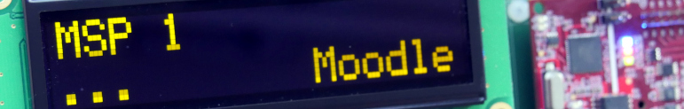
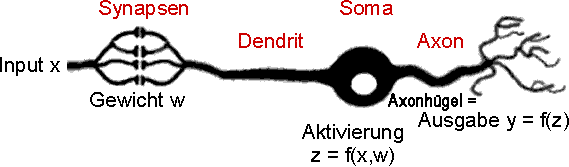

# Studium-Tu-Ilmenau

Dieses Repository enthält alle Projekte und Aufgaben aus meinem Studium an der Technischen Universität Ilmenau. Die enthaltenen Kurse und Projekte sind unten aufgelistet.

## Inhalt

### Mikrocontroller- und Signalprozessortechnik 1 (MSP 1)

In diesem Kurs beschäftigen wir uns mit der Programmierung und Steuerung von Mikrocontrollern. Der Ordner `MSP1` enthält:

- **Aufgaben**: Hier befinden sich alle Aufgaben, die wir während des Kurses erhalten haben.
- **Prüfungsaufgabe**: Die abschließende Prüfungsaufgabe des Kurses.

#### Verwendete Technologien

- **Programmiersprache**: C

### Neuroinformatik

In diesem Kurs befassen wir uns mit verschiedenen Methoden und Algorithmen der Neuroinformatik. Der Ordner `Neuroinformatik` enthält zwei Praktikumsdateien:

- **Kohonen-Ring**: Eine selbstorganisierende Feature-Map zur Lösung des Traveling-Salesman-Problems.
- **Multi-Layer-Perzeptron (MLP)**: Implementierung eines MLP von Grund auf, um die Grundlagen von Deep-Learning-Frameworks wie PyTorch, TensorFlow oder Keras zu verstehen.

#### Verwendete Technologien

- **Programmiersprache**: Python
- **Tools**: Jupyter Notebook

## Projektstruktur

Das Repository ist nach Kursen strukturiert:

* Studium-Tu-Ilmenau
    * MSP1
        * Aufgaben
        * Pruefungsaufgabe
    * Neuroinformatik
        * Praktikum
            * Kohonen-Ring.ipynb
            * MLP.ipynb

## Kontakt

Bei Fragen oder Anregungen könnt ihr mich gerne kontaktieren:

- **E-Mail**: [philipp.fiedler@tu-ilmenau.de](mailto:philipp.fiedler@tu-ilmenau.de)

## Lizenz

Dieses Projekt steht unter der MIT-Lizenz. Weitere Informationen findest du in der [LICENSE](./Image_LICENSE/LICENSE) Datei.
